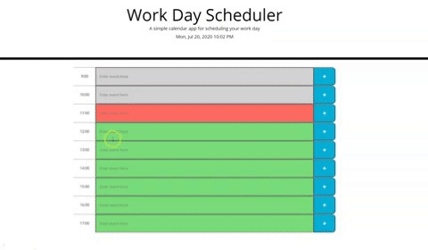

# 05 Work Day Scheduler

This is a Simple application to create hourly events throughout the working day. This application runs in the browser and features dynamically updated HTML and CSS powered by jQuery.

## Functionality

When the user clicks in an empty time block, the user is given the option to type an event in there. The user can then save the event by clicking the button on the right.

## Images

