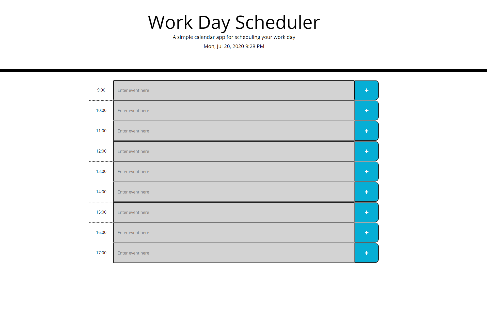

# Work Day Scheduler

This is a Simple application to create hourly events throughout the working day. This application runs in the browser and features dynamically updated HTML and CSS powered by jQuery.

## Functionality

When the user clicks in an empty time block, the user is given the option to type an event in there. The user can then save the event by clicking the button on the right. The events are stored in local storage and will not be erased when the page is reloaded. The time blocks are colored to represent past, present, and future depending on the time of day at the top of the page.

## Sources

moment.js - used for time management within the code.

## Images

## Application in use

